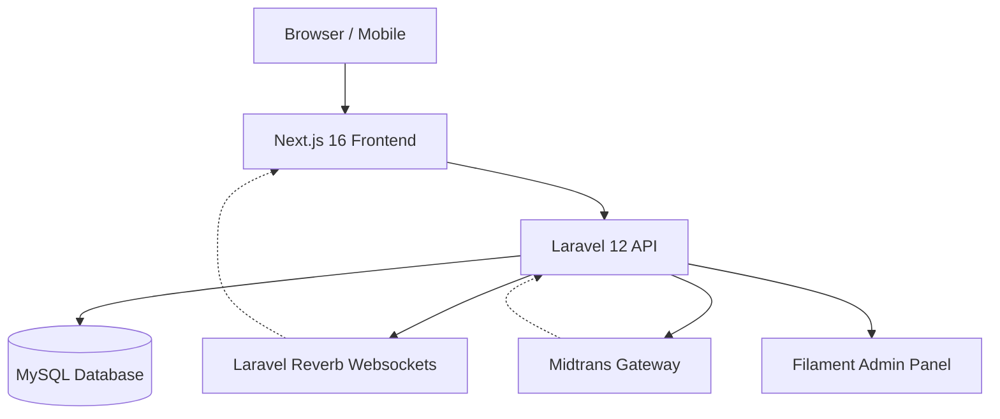

# 🧶 Recloth — Premium C2C Marketplace & Swap Platform

Recloth adalah platform marketplace C2C (Consumer-to-Consumer) khusus untuk komunitas premium thrifting. Sistem ini memadukan pengalaman belanja modern dengan fitur unik **Barter (Swap)**, didukung oleh sistem **Escrow** yang aman, chat real-time, dan dashboard seller yang komprehensif.

---

## 📋 Daftar Isi

- [Fitur Utama](#-fitur-utama)
- [Tech Stack](#-tech-stack)
- [Arsitektur Sistem](#-arsitektur-arsitektur)
- [Setup Cepat (Sekali Klik)](#-setup-cepat-sekali-klik)
- [Setup Per Komponen](#-setup-per-komponen)
- [Menjalankan Aplikasi](#-menjalankan-aplikasi)
- [Akun Default](#-akun-default)
- [Struktur Proyek](#-struktur-proyek)
- [Alur Aplikasi](#-alur-aplikasi)

---

## ✨ Fitur Utama

### Marketplace (Beli)
- **Katalog Premium**: Grid 3-kolom responsif dengan infinite scroll (TanStack Query).
- **Search & Filter**: Pencarian cepat berdasarkan kategori dan filter cerdas.
- **Varian & Detail**: Informasi kondisi (Grade A-D), ukuran, dan berat yang akurat.
- **Cart & Checkout**: Manajemen keranjang per item dengan kalkulasi ongkir real-time.

### Swap (Barter)
- **Ajukan Swap**: Tukarkan barangmu dengan barang user lain.
- **Sistem Negosiasi**: Real-time request dan manajemen tawaran barter.
- **Escrow Guard**: Dana atau barang ditahan sistem sampai kedua pihak konfirmasi terima.

### Seller Dashboard
- **Manajemen Inventori**: Upload produk mudah dengan multiple photo upload.
- **Stats Penjualan**: Grafik pendapatan dan statistik performa toko.
- **Manajemen Pesanan**: Proses pesanan, input resi, dan kelola penarikan dana.

### Wallet & Payment
- **Wallet System**: Saldo in-app untuk belanja instan dan withdraw ke rekening.
- **Midtrans Integration**: Support payment gateway (QRIS, VA, Bank Transfer).
- **History Transaksi**: Log detail untuk top-up, pembayaran, dan penarikan.

### Real-time Communication
- **Real-time Messenger**: Chat instan antar pengguna dengan Laravel Reverb.
- **Status Indicator**: Indikator sedang mengetik, terkirim, dan telah dibaca.

---

## 🛠 Tech Stack

| Layer | Teknologi |
|---|---|
| **Backend** | Laravel 12, PHP 8.2+ |
| **Admin Panel** | Filament 5.3 |
| **Frontend** | Next.js 16 (App Router), React 19 |
| **Styling** | Tailwind CSS 4 |
| **State** | Zustand 5, TanStack React Query 5 |
| **WebSocket** | Laravel Reverb |
| **Auth** | Laravel Sanctum (Bearer Token) |
| **Payment** | Midtrans (Core API) |
| **Database** | MySQL / MariaDB |
| **Role/Permission** | Spatie Laravel Permission |

---

## 🏗 Arsitektur Sistem



---

## 🚀 Setup Cepat (Sekali Klik)

### Prasyarat
- **PHP** >= 8.2 & **Composer**
- **Node.js** >= 18.x & **npm**
- **MySQL** / **MariaDB**

### Windows (Setup & Jalankan)

Dari root folder proyek:

```powershell
# 1. Setup dependensi (BE & FE)
.\setup.bat

# 2. Jalankan semua service sekaligus
.\run-all.bat
```

### Script Init Khusus Backend
Jika ingin reset database dan data demo:
```bash
cd recloth-be
php artisan migrate:fresh --seed
```

---

## 👤 Akun Default

Gunakan kredensial berikut untuk mengeksplorasi platform (Password: `password`):

| Role | Email | Akses Utama |
|---|---|---|
| **Super Admin** | `admin@recloth.id` | Filament CMS (`/admin`) |
| **Seller** | `penjual@recloth.id` | Dashboard Toko & Katalog |
| **Buyer** | `pembeli@recloth.id` | Katalog & Swap Flow |

---

## 📁 Struktur Proyek

```
recloth/
├── recloth-be/                  # Backend API (Laravel 12)
│   ├── app/
│   │   ├── Http/Controllers/    # API Logics (Order, Product, Swap, etc.)
│   │   ├── Models/              # Database Models
│   │   └── Services/            # Business Logic (Escrow Service)
│   ├── database/                # Reality-based Indonesia Seeders
│   └── routes/                  # API & Broadcast Routes
│
├── recloth-fe/                  # Frontend App (Next.js 16)
│   ├── src/
│   │   ├── app/                 # App Router (Pages & Layouts)
│   │   ├── components/          # Reusable UI Components
│   │   ├── hooks/               # Custom Logic Hooks
│   │   └── lib/                 # API Client & Utilities
│
├── api.yaml                     # 📄 OpenAPI 3.0 Specification
├── setup.bat                    # ⚡ Automation: Install All Dependencies
└── run-all.bat                  # ▶ Automation: Start BE, FE, & Reverb
```

---

## 🔄 Alur Utama Aplikasi

### Alur Beli (Marketplace)
1. Buyer mencari produk melalui katalog.
2. Tambahkan ke keranjang dan pilih kurir.
3. Checkout dan bayar (Midtrans/Wallet).
4. Penjual proses pesanan & input resi.
5. Dana ditahan sistem (**Escrow**) sampai barang diterima buyer.

### Alur Barter (Swap)
1. Buyer mengajukan permintaan swap untuk produk target.
2. Buyer memilih produk miliknya sendiri sebagai penukar.
3. Penjual menerima/menolak ajuan swap.
4. Jika diterima, kedua pihak mengirim barang.
5. Sistem memastikan transaksi adil sebelum status selesai.

---

## 📄 Lisensi

MIT License — Dikembangkan dengan ❤️ untuk Komunitas Thrifting.